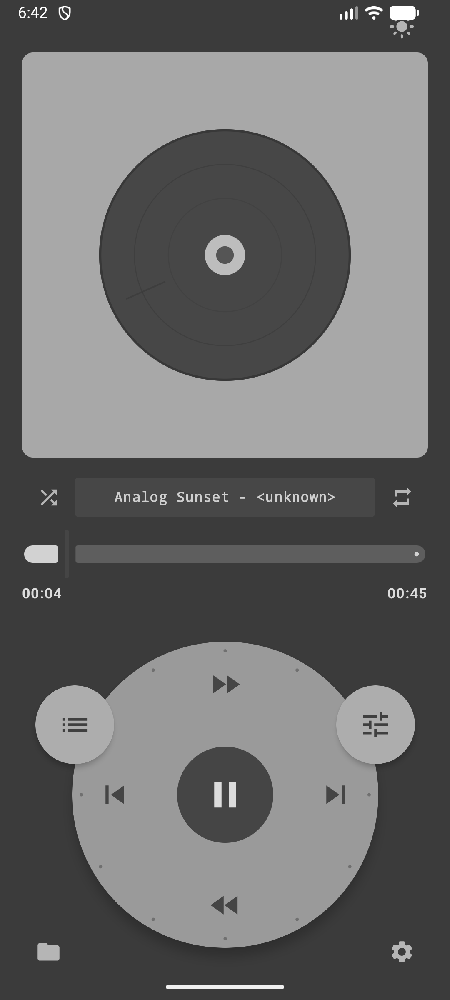
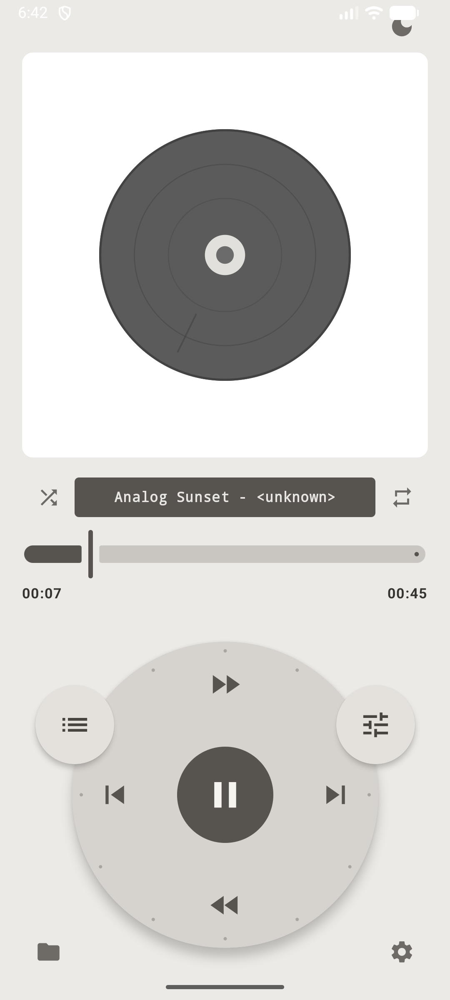
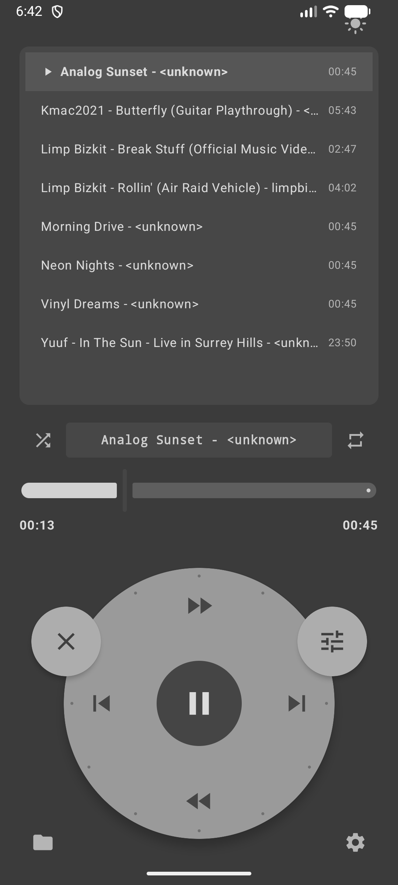
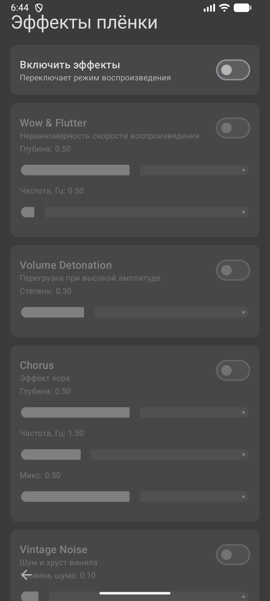
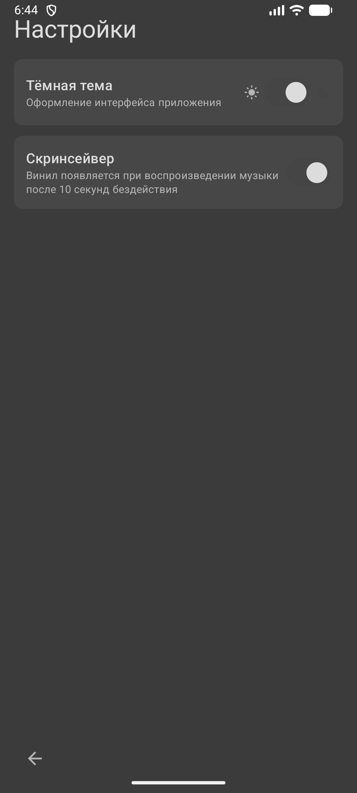
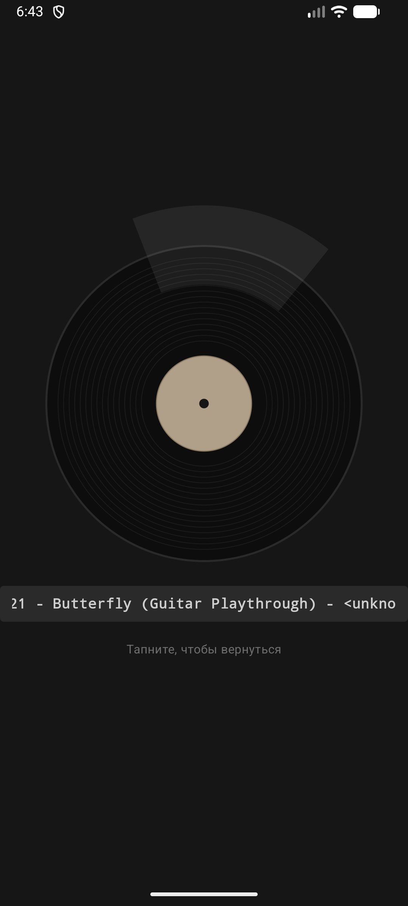

# CirclePlayer v1.0

Плёночный музыкальный плеер для Android в стиле iPod Classic: колесо управления, эффекты винила и скринсейвер.

## Скриншоты

| Плеер (тёмная тема) | Плеер (светлая тема) | Выбор трека колесом |
|---|---|---|
|  |  |  |

| Меню эффектов | Настройки | Скринсейвер |
|---|---|---|
|  |  |  |

## Возможности

- **Колесо управления (Click Wheel)** — прокрутка списка жестом с тактильной отдачей, play/pause в центре, статичные кнопки перемотки и перехода между треками
- **Выбор трека колесом** — панель плеера превращается в список, выделение крутится колесом
- **Эффекты плёнки** (обрабатывают PCM в реальном времени через `AudioProcessor`):
  - **Wow & Flutter** — плавающая нестабильность скорости
  - **Volume Detonation** — лёгкая перегрузка на пиках амплитуды
  - **Chorus** — классический хор с модулируемой задержкой
  - **Vintage Noise** — белый шум и хруст винила
- **Скринсейвер** — вращающаяся виниловая пластинка (вручную или автоматически через 10 с бездействия при воспроизведении)
- **Светлая / тёмная тема**, выбор папки с музыкой, shuffle и repeat (all / one)
- Корректная обработка системного жеста «назад»

## APK

- Релизный билд: [app/app-release.apk](app/app-release.apk)
- Отладочный билд: [app/app-debug.apk](app/app-debug.apk)

> Минимальный Android: 7.1 (API 25)

## Сборка

```bash
./gradlew assembleDebug   # отладочный
./gradlew assembleRelease # релизный (подписан debug-ключом)
```
