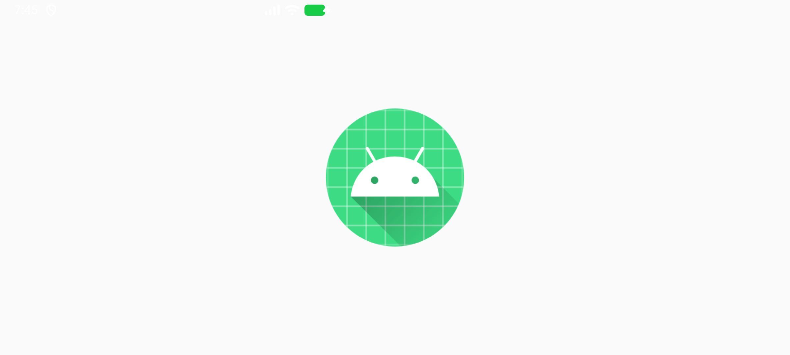
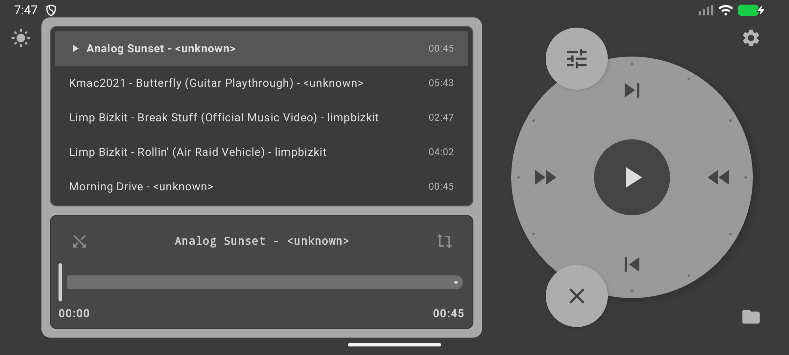

# CirclePlayer v1.5

Плёночный музыкальный плеер для Android в стиле iPod Classic: колесо управления, эффекты винила и скринсейвер.

## Скриншоты

| Плеер (тёмная тема) | Плеер (светлая тема) | Выбор трека колесом |
|---|---|---|
|  |  |  |

| Меню эффектов | Настройки | Скринсейвер |
|---|---|---|
|  |  |  |

| Ландшафт: плеер | Ландшафт: выбор трека |
|---|---|
|  |  |

## Возможности

- **Колесо управления (Click Wheel)** — верхняя кнопка Menu, нижняя Play/Pause, центр подтверждает выбор; прокрутка списка даёт тактильный и звуковой отклик, настраиваемый в настройках
- **Выбор треков и папок колесом** — списки показываются на мини-дисплее; Menu возвращает к родительской папке
- **Адаптивный интерфейс** — безопасные отступы от системных панелей и масштабирование под доступный размер экрана
- **Обложка альбома на виниле** — при наличии обложки она отображается текстурой вращающейся пластинки
- **Альбомная ориентация** — корпус с колесом зафиксирован относительно устройства, значки и дисплеи (список + блок активного трека с перемоткой) разворачиваются к пользователю
- **Эффекты плёнки** (обрабатывают PCM в реальном времени через `AudioProcessor`):
  - **Wow & Flutter** — плавающая нестабильность скорости
  - **Volume Detonation** — лёгкая перегрузка на пиках амплитуды
  - **Chorus** — классический хор с модулируемой задержкой
  - **Vintage Noise** — белый шум и хруст винила
- **Скринсейвер** — вращающаяся виниловая пластинка (вручную или автоматически через 10 с бездействия при воспроизведении)
- **Настройка винила** — ручная скорость вращения и синхронизация с BPM-тегом текущего трека
- **Темы оформления** — готовые классическая, хакерская, киберпанк и жёлто-чёрная темы; настройка цветов, сохранение и обмен пресетами в JSON
- **Настройка интерфейса** — отдельный масштаб элементов для портретной и альбомной ориентации, русский и английский языки
- **Светлая / тёмная тема**, выбор папки из медиатеки или системного проводника, shuffle и repeat (all / one)
- **Пользовательский звук Click Wheel** — выбор собственного аудиофайла для щелчка прокрутки
- **Системное управление воспроизведением** — уведомление и медиа-контролы Android, включая кнопки Play/Pause на гарнитуре
- Корректная обработка системного жеста «назад»

## История изменений

- [v1.5 — темы, язык, настройки Click Wheel и оптимизации](docs/releases/v1.5.md)

## APK

- Последний релиз APK: [CirclePlayer v1.5](https://github.com/KrechkoVsevolod201/CirclePlayer/releases/latest)

> Минимальный Android: 7.1 (API 25)

## Сборка

```bash
./gradlew assembleDebug   # отладочный
./gradlew assembleRelease # релизный (подписан debug-ключом)
```

## Форки и разработка

Материалы для изучения и создания форков собраны в [`docs/fork-kit`](docs/fork-kit): контекст проекта, архитектурные решения и копии Android/Compose skills. Канонические skills для OpenCode остаются в [`.opencode/skills`](.opencode/skills).
